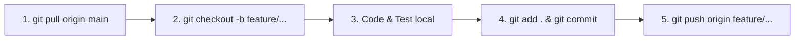

# 🌿 HireMate AI - Nền Tảng Tuyển Dụng & Phỏng Vấn AI Thông Minh

> **FPT University - SWP391 Capstone Project (Group 5)**  
> Kiến trúc Monorepo chuẩn doanh nghiệp: **Spring Boot 3.2.4 (Java 21)** + **React 18 (Vite)** + **Supabase Cloud PostgreSQL** + **Google Gemini AI**.

---

## 📥 1. Yêu Cầu Môi Trường & Link Tải Phần Mềm (Prerequisites)

Để toàn bộ thành viên trong nhóm chạy được dự án mượt mà, **mỗi thành viên CHỈ CẦN cài đặt 3 phần mềm sau vào máy tính cá nhân** (tải 1 lần duy nhất):

| Phần mềm | Phiên bản yêu cầu | Link tải chính thức | Mục đích |
| :--- | :---: | :---: | :--- |
| **JDK (Java)** | **Java 21 (LTS)** | 🔗 [Tải Eclipse Adoptium Temurin 21](https://adoptium.net/temurin/releases/?version=21) *(hoặc Oracle JDK 21)* | Chạy Backend Spring Boot 3.2.4 |
| **Node.js** | **v20.x (LTS)** *(hoặc v18+)* | 🔗 [Tải Node.js LTS Installer](https://nodejs.org/en/download) | Chạy Frontend React 18 & Vite |
| **Git** | **Latest** | 🔗 [Tải Git for Windows/Mac](https://git-scm.com/downloads) | Quản lý mã nguồn & làm việc nhóm |
| **IDE Khuyên dùng** | **VS Code** hoặc **IntelliJ IDEA** | 🔗 [VS Code](https://code.visualstudio.com/) / [IntelliJ IDEA](https://www.jetbrains.com/idea/) | Soạn thảo code & debug |

> [!IMPORTANT]
> 🌟 **LƯU Ý ĐẶC BIỆT VỀ CƠ SỞ DỮ LIỆU (DATABASE):**  
> Team **KHÔNG CẦN CÀI ĐẶT PostgreSQL hay pgAdmin trên máy local**. Cơ sở dữ liệu đã được cấu hình chạy trực tiếp trên **Supabase Cloud**. Toàn bộ team dùng chung 1 CSDL đám mây duy nhất, tự động đồng bộ 100% dữ liệu.

---

## 🚀 2. Hướng Dẫn Khởi Chạy Dự Án (Quick Start)

### Bước 1: Clone mã nguồn về máy
Mở Terminal / PowerShell và gõ:
```bash
git clone https://github.com/hdung201104/SWP391_GROUP5.git
cd SWP391_GROUP5
```

---

### Bước 2: Khởi chạy Frontend (React + Vite)
Mở một cửa sổ Terminal:
```bash
# 1. Di chuyển vào thư mục frontend
cd hiremate-frontend

# 2. Cài đặt các thư viện (chỉ cần chạy lần đầu hoặc khi có thư viện mới)
npm install

# 3. Khởi chạy giao diện phát triển
npm run dev
```
* 🌐 **Giao diện Web:** `http://localhost:3000`
* Frontend đã cấu hình sẵn Vite Proxy để tự động chuyển tiếp các request `/api/v1/...` sang Backend cổng 8080.

---

### Bước 3: Khởi chạy Backend (Spring Boot 3 & Java 21)
Mở một cửa sổ Terminal **thứ hai**:
```bash
# 1. Di chuyển vào thư mục backend
cd hiremate-backend

# 2. Biên dịch và khởi chạy Spring Boot
mvn spring-boot:run
```
* 🔌 **Backend REST API:** `http://localhost:8080`
* Backend sẽ tự động kết nối tới **Supabase Cloud PostgreSQL** qua SSL và tự động chạy Flyway Migration tạo 16 bảng chuẩn hóa.

---

## 🌿 3. Cẩm Nang Toàn Tập Các Lệnh Git Dành Cho Team (Git Cheatsheet)

Để phối hợp làm việc nhóm không bị đè code, mất code hoặc lỗi merge conflict, cả team tuân thủ quy trình Git Flow dưới đây:

### 3.1. Bảng tra cứu các lệnh Git thường dùng hằng ngày

| Thao tác | Câu lệnh Git | Giải thích |
| :--- | :--- | :--- |
| **Kiểm tra trạng thái file** | `git status` | Xem những file nào vừa sửa, thêm mới hoặc xóa |
| **Cập nhật code mới nhất từ team** | `git pull origin main` | Tải toàn bộ code mới nhất của các bạn khác về máy mình |
| **Tạo nhánh mới để làm tính năng** | `git checkout -b feature/<ten-tinh-nang>` | Tạo và chuyển sang nhánh riêng của bạn |
| **Chuyển qua lại giữa các nhánh** | `git checkout <ten-nhanh>` | Chuyển sang làm việc ở nhánh khác |
| **Xem danh sách các nhánh** | `git branch` | Xem hiện tại đang đứng ở nhánh nào |
| **Lưu tạm code khi chưa muốn commit** | `git stash` | Cất tạm code đang viết dở để pull code mới |
| **Lấy lại code đã lưu tạm** | `git stash pop` | Lấy lại code vừa cất ra làm tiếp |
| **Thêm tất cả thay đổi vào hàng chờ**| `git add .` | Chuẩn bị commit tất cả file đã chỉnh sửa |
| **Lưu commit kèm ghi chú** | `git commit -m "feat: mo ta noi dung"` | Đóng gói commit lên máy local |
| **Đẩy nhánh của mình lên GitHub** | `git push -u origin feature/<ten-nhanh>` | Đẩy nhánh lên GitHub để team review |
| **Xem lịch sử các commit gần nhất** | `git log --oneline -n 5` | Xem 5 commit mới nhất |

---

### 3.2. Quy Trình 5 Bước Làm Việc Của Mỗi Thành Viên (Chuẩn Workflow)

Khi được giao làm một chức năng mới (Ví dụ: Làm màn hình Quản lý Người dùng `admin-user-management`):



#### 🔹 Bước 1: Luôn cập nhật code mới nhất từ `main` trước khi làm
```bash
git checkout main
git pull origin main
```

#### 🔹 Bước 2: Tạo nhánh tính năng riêng của bạn
```bash
# Quy tắc đặt tên nhánh: feature/<tên-ngắn-gọn> hoặc fix/<tên-lỗi>
git checkout -b feature/admin-user-management
```

#### 🔹 Bước 3: Viết code và test chạy thử trên máy của bạn
* Chạy thử `mvn clean compile` và `npm run build` để đảm bảo code không bị lỗi đỏ.

#### 🔹 Bước 4: Lưu commit với thông điệp rõ ràng
```bash
git add .
git commit -m "feat: hoan thien giao dien quan ly nguoi dung cho admin"
```

#### 🔹 Bước 5: Đẩy nhánh lên GitHub và tạo Pull Request (PR)
```bash
git push -u origin feature/admin-user-management
```
* Lên GitHub bấm nút **Compare & pull request** để Trưởng nhóm (Leader) kiểm tra và duyệt gộp vào nhánh `main`.

---

### 3.3. Quy ước Đặt Tên Commit (Conventional Commits)
* `feat: ...` : Thêm tính năng mới (VD: `feat: add OTP email verification modal`)
* `fix: ...`  : Sửa lỗi (VD: `fix: fix database foreign key on candidates table`)
* `refactor: ...`: Tối ưu / dọn dẹp lại code mà không thay đổi nghiệp vụ
* `style: ...`: Chỉnh sửa CSS, giao diện, màu sắc, font chữ
* `docs: ...` : Cập nhật tài liệu README, đặc tả hệ thống

---

## 🏗️ 4. Cấu Trúc Thư Mục Dự Án (Monorepo Architecture)

```text
SWP391_GROUP5/
├── .gitignore                     # Cấu hình bỏ qua target/, node_modules/, .env
├── AGENTS.md                      # Hướng dẫn quy tắc code dành cho AI & Developer
├── PROJECT_MASTER_SPECIFICATION.md# Đặc tả 16 bảng CSDL 3NF, API Endpoints & Logic AI
├── HireMate_AI_New.sql            # File DDL CSDL tham khảo (Đã triển khai trên Supabase)
├── README.md                      # Tài liệu hướng dẫn khởi chạy & Git quy chuẩn
├── pom.xml                        # Maven Root Aggregator
│
├── hiremate-backend/              # [BACKEND] Spring Boot 3.2.4 REST API Service (Java 21)
│   ├── src/main/java/com/hiremate/
│   │   ├── config/                # Cấu hình Spring Security, JWT Filter, CORS
│   │   ├── controller/            # REST Controllers (/api/v1/auth, /jobs, /interviews...)
│   │   ├── dto/                   # Request & Response Data Transfer Objects
│   │   ├── entity/                # 16 JPA Entities chuẩn PostgreSQL 3NF
│   │   ├── enums/                 # UserRole, JobStatus, ApplicationStatus...
│   │   ├── exception/             # GlobalExceptionHandler xử lý lỗi toàn cục
│   │   ├── repository/            # 16 Spring Data JPA Repositories
│   │   └── service/               # Business Logic Services
│   ├── src/main/resources/
│   │   ├── application.yml        # Cấu hình kết nối Supabase Cloud & Gemini API
│   │   └── db/migration/          # V1__init_schema.sql (Flyway Migration)
│   └── pom.xml                    # Cấu hình dependencies Java 21 & Spring Boot
│
└── hiremate-frontend/             # [FRONTEND] React 18 Single Page Application (Vite)
    ├── src/
    │   ├── api/                   # Axios Client & API Services (/auth, /jobs, /interview...)
    │   ├── components/            # UI Components tái sử dụng (Header, Footer, Modals...)
    │   ├── context/               # LivingThemeContext & Auth State
    │   ├── pages/                 # Màn hình chức năng (HomePage, AiInterview, Profile...)
    │   ├── App.jsx                # Router & phân quyền người dùng
    │   └── index.css              # Design System Botanical Modern cao cấp
    ├── package.json               # Frontend dependencies (React 18, Tailwind CSS, Lucide Icons)
    └── vite.config.js             # Cấu hình Vite Server & Proxy sang :8080
```

---

## 🔒 5. Nguyên Tắc Bảo Mật Cho Team
* **Tuyệt đối KHÔNG commit các thư mục sau lên Git:**
  - `node_modules/`: Rất nặng (hàng trăm MB), máy cá nhân tự sinh ra khi gõ `npm install`.
  - `target/`, `*.class`, `*.jar`: File nhị phân sinh ra khi biên dịch Java.
  - File bí mật cá nhân (`.env.local`, API Key cá nhân).
* *Tất cả các thư mục trên đã được tự động chặn an toàn trong file `.gitignore`.*

---

## 📞 Hỗ Trợ Kỹ Thuật Trong Team
Nếu bạn gặp bất kỳ lỗi nào khi chạy `mvn spring-boot:run` hoặc `npm run dev`:
1. Đảm bảo bạn đã cài đúng **Java 21** và **Node.js LTS**.
2. Kiểm tra terminal xem cổng **8080** hoặc **3000** có đang bị ứng dụng khác chiếm giữ không.
3. Nhắn ngay lên nhóm Zalo / Discord của team để được hỗ trợ giải quyết!
