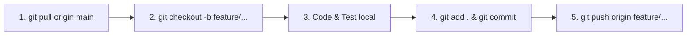

# 🌿 HireMate AI - Nền Tảng Tuyển Dụng & Phỏng Vấn AI Thông Minh

> **FPT University - SWP391 Capstone Project (Group 5)**  
> Kiến trúc Monorepo chuẩn doanh nghiệp: **Spring Boot 3.2.4 (Java 21)** + **React 18 (Vite)** + **Supabase Cloud PostgreSQL** + **Google Gemini AI**.

---

## 📥 1. Yêu Cầu Môi Trường & Link Tải Phần Mềm (Prerequisites)

Để toàn bộ thành viên trong nhóm chạy được dự án mượt mà, **mỗi thành viên BẮT BUỘC phải dùng đúng các phiên bản sau** (để tránh lỗi mỗi người một phiên bản không chạy được):

| Phần mềm / Môi trường | Phiên bản BẮT BUỘC của nhóm | Link tải chính thức (Windows x64) | Mục đích & Lưu ý |
| :--- | :---: | :---: | :--- |
| **JDK (Java SDK)** | **Java 21 (LTS)** | 🔗 [Tải Temurin 21 (.msi)](https://github.com/adoptium/temurin21-binaries/releases/download/jdk-21.0.4%2B7/OpenJDK21U-jdk_x64_windows_hotspot_21.0.4_7.msi) *(Hoặc [Oracle JDK 21](https://www.oracle.com/java/technologies/downloads/#java21))* | Chạy Backend **Spring Boot 3.2.4**. *(Tuyệt đối không dùng Java 8/11/17 - sẽ lỗi compile ngay)* |
| **Spring Boot Framework** | **`3.2.4`** | *(Đã cấu hình sẵn trong `pom.xml`)* | Khung ứng dụng Backend. **Tất cả thành viên giữ nguyên `3.2.4`, không tự ý đổi lên 3.3.x hay xuống 3.1.x** |
| **Apache Maven** | **`3.9.x`** *(Khuyên dùng 3.9.9 / 3.9.16)* | 🔗 [Tải Apache Maven 3.9.9 (.zip)](https://dlcdn.apache.org/maven/maven-3/3.9.9/binaries/apache-maven-3.9.9-bin.zip) | Build & quản lý thư viện. *(Tối thiểu 3.8.x, khuyên dùng 3.9.x. Nếu dùng IntelliJ thì đã có sẵn trong IDE)* |
| **Node.js** | **`v20.x (LTS)`** | 🔗 [Tải Node.js 20.x LTS (.msi)](https://nodejs.org/dist/v20.18.0/node-v20.18.0-x64.msi) *(Hoặc [Node.js](https://nodejs.org/en/download))* | Chạy Frontend **React 18 & Vite** |
| **Git** | **Latest (Mới nhất)** | 🔗 [Tải Git 64-bit (.exe)](https://github.com/git-for-windows/git/releases/latest) | Đồng bộ mã nguồn nhóm qua GitHub |
| **IDE Khuyên dùng** | **IntelliJ IDEA** *(hoặc VS Code)* | 🔗 [Tải IntelliJ Community](https://www.jetbrains.com/idea/download/) / [Tải VS Code](https://code.visualstudio.com/Download) | Soạn thảo, tự động nhận diện Java 21 & Maven |

---

### 🔍 Checklist Kiểm Tra Phiên Bản Trên Máy Trước Khi Chạy (BẮT BUỘC PHẢI KHỚP)
Mở PowerShell / Terminal gõ các lệnh sau để kiểm tra môi trường máy của bạn:

```bash
# 1. Kiểm tra Java (Bắt buộc phải là Java 21)
java -version
# 👉 Kết quả chuẩn: openjdk version "21.0.x" ... (Nếu hiện Java 8/11/17 là SAI, phải chuyển sang Java 21)

# 2. Kiểm tra Maven (Bắt buộc Maven 3.8+ hoặc 3.9+ và Java runtime là 21)
mvn -v
# 👉 Kết quả chuẩn:
# Apache Maven 3.9.x ...
# Java version: 21.0.x ... (LƯU Ý: Nếu Maven báo "Java version: 17/11/8" là sai môi trường, phải sửa JAVA_HOME)

# 3. Kiểm tra Spring Boot (Xem dòng 8 trong hiremate-backend/pom.xml)
# 👉 Chuẩn toàn nhóm: <version>3.2.4</version>

# 4. Kiểm tra Node.js (Bắt buộc v20 LTS hoặc v18.18+)
node -v
# 👉 Kết quả chuẩn: v20.x.x

# 5. Kiểm tra npm
npm -v
# 👉 Kết quả chuẩn: 10.x.x

# 6. Kiểm tra Git
git --version
# 👉 Kết quả chuẩn: git version 2.x.x
```

---

### ⚠️ CÁC LỖI THƯỜNG GẶP NẾU BỊ LỆCH PHIÊN BẢN MAVEN HOẶC SPRING BOOT:
1. **Dùng Maven cũ (< 3.8.x) hoặc Maven trỏ nhầm Java 17/11:**
   - ❌ Lỗi: `Fatal error compiling: invalid target release: 21` hoặc `Unsupported class file major version`.
   - ✅ Sửa: Cập nhật biến môi trường `JAVA_HOME` trỏ đúng vào thư mục cài `jdk-21`.
2. **Tự ý sửa version Spring Boot trong `pom.xml`:**
   - ❌ Lỗi: Khi một bạn đổi Spring Boot lên `3.3.4` còn các bạn khác ở `3.2.4`, khi `git pull` sẽ bị xung đột conflict và lỗi không tương thích phiên bản thư viện con.
   - ✅ Quy tắc: **Không ai được sửa thẻ `<parent><version>3.2.4</version></parent>` trong `pom.xml`**.

---

### ⚙️ Danh Mục Toàn Bộ Thư Viện Chuẩn Trong `pom.xml` (Đã đồng bộ)
| Công nghệ / Thư viện | Phiên bản chuẩn | Cách thức hoạt động |
| :--- | :---: | :--- |
| **Spring Boot** | **`3.2.4`** | Framework Backend chính (Bắt buộc chạy trên **Java 21**) |
| **Java SDK** | **`21 (LTS)`** | Ngôn ngữ backend (source/target: 21) |
| **Apache Maven** | **`3.9.x`** | Trình quản lý build & tải tự động các dependencies |
| **Lombok** | **Theo Spring Boot BOM** | Tự sinh Getter/Setter *(Phải bật Annotation Processing trong IDE)* |
| **Apache PDFBox** | **`3.0.2`** | Xử lý trích xuất văn bản từ CV file PDF của ứng viên |
| **SpringDoc OpenAPI** | **`2.5.0`** | Tự sinh Swagger UI tra cứu API tại: `http://localhost:8080/swagger-ui/index.html` |
| **JJWT (Auth Token)** | **`0.12.5`** | Mã hóa & xác thực Token đăng nhập JWT |
| **TestNG & JaCoCo** | **`7.9.0` / `0.8.11`** | Bộ công cụ viết test & đo % độ bao phủ code phục vụ chấm điểm đồ án SWP391 |
| **Cơ sở dữ liệu** | **PostgreSQL (Supabase Cloud)** | Đám mây đồng bộ 100%, có Flyway tự chạy migration schema `V1__init_schema.sql` |
| **Frontend** | **React `18.3.1` + Vite `5.4.x`** | Cổng dev server: `http://localhost:3000` |

---

### 🛠️ Cài Đặt IDE Để Không Bị Lỗi Đỏ Lombok (Bắt Buộc Làm 1 Lần)
* **Nếu dùng IntelliJ IDEA (Khuyên Dùng):**
  1. Vào `Settings` (phím tắt `Ctrl + Alt + S`) -> Tìm kiếm từ khóa: `Annotation Processors`.
  2. Tích chọn ô **Enable annotation processing** -> Bấm `Apply` & `OK`.
  3. Cấu hình SDK: Vào `File` -> `Project Structure` -> `Project` -> Chọn **SDK 21**.
* **Nếu dùng VS Code:**
  1. Cài đặt Extension: **Extension Pack for Java** (của Microsoft).
  2. Cài đặt thêm Extension: **Lombok Annotations Support for VS Code**.

---

> [!IMPORTANT]
> 🌟 **LƯU Ý ĐẶC BIỆT VỀ CƠ SỞ DỮ LIỆU (DATABASE):**  
> Team **KHÔNG CẦN CÀI ĐẶT PostgreSQL hay pgAdmin trên máy local**. Cơ sở dữ liệu đã được cấu hình chạy trực tiếp trên **Supabase Cloud**. Toàn bộ team dùng chung 1 CSDL đám mây duy nhất, tự động đồng bộ 100% dữ liệu qua Flyway Migration khi khởi chạy backend.

---

## 🚀 2. Hướng Dẫn Khởi Chạy Dự Án (Quick Start)

### Bước 1: Clone mã nguồn về máy
Mở Terminal / PowerShell và gõ:
```bash
git clone https://github.com/hdung201104/SWP391_GROUP5.git
cd SWP391_GROUP5
```

---

### Bước 2: Khởi chạy Frontend (React + Vite)
Mở một cửa sổ Terminal:
```bash
# 1. Di chuyển vào thư mục frontend
cd hiremate-frontend

# 2. Cài đặt các thư viện (chỉ cần chạy lần đầu hoặc khi có thư viện mới)
npm install

# 3. Khởi chạy giao diện phát triển
npm run dev
```
* 🌐 **Giao diện Web:** `http://localhost:3000`
* Frontend đã cấu hình sẵn Vite Proxy để tự động chuyển tiếp các request `/api/v1/...` sang Backend cổng 8080.

---

### Bước 3: Khởi chạy Backend (Spring Boot 3 & Java 21)

Thành viên có thể chọn **1 trong 2 cách** sau để chạy Backend:

* **Cách 1: Khởi chạy bằng IntelliJ IDEA (Khuyên dùng - Đơn giản nhất, không cần cài Maven rời):**
  1. Mở thư mục dự án `SWP391_GROUP5` bằng IntelliJ IDEA.
  2. Chờ IntelliJ tự động đồng bộ Maven dependencies (thấy thanh dưới góc phải chạy xong).
  3. Mở file `hiremate-backend/src/main/java/com/hiremate/HiremateApplication.java`.
  4. Bấm vào nút **Run** (biểu tượng tam giác xanh ▶️ bên cạnh hàm `main`).

* **Cách 2: Khởi chạy bằng Terminal (Nếu máy đã cài Apache Maven):**
  Mở cửa sổ Terminal thứ hai:
  ```bash
  cd hiremate-backend
  mvn spring-boot:run
  ```

* 🔌 **Backend REST API:** `http://localhost:8080`  
* 📄 **Swagger UI tra cứu API:** `http://localhost:8080/swagger-ui/index.html`  
* Backend sẽ tự động kết nối tới **Supabase Cloud PostgreSQL** qua SSL và tự động chạy Flyway Migration tạo 16 bảng chuẩn hóa.

---

## 🌿 3. Cẩm Nang Toàn Tập Các Lệnh Git Dành Cho Team (Git Cheatsheet)

Để phối hợp làm việc nhóm không bị đè code, mất code hoặc lỗi merge conflict, cả team tuân thủ quy trình Git Flow dưới đây:

### 3.1. Bảng tra cứu các lệnh Git thường dùng hằng ngày

| Thao tác | Câu lệnh Git | Giải thích |
| :--- | :--- | :--- |
| **Kiểm tra trạng thái file** | `git status` | Xem những file nào vừa sửa, thêm mới hoặc xóa |
| **Cập nhật code mới nhất từ team** | `git pull origin main` | Tải toàn bộ code mới nhất của các bạn khác về máy mình |
| **Tạo nhánh mới để làm tính năng** | `git checkout -b feature/<ten-tinh-nang>` | Tạo và chuyển sang nhánh riêng của bạn |
| **Chuyển qua lại giữa các nhánh** | `git checkout <ten-nhanh>` | Chuyển sang làm việc ở nhánh khác |
| **Xem danh sách các nhánh** | `git branch` | Xem hiện tại đang đứng ở nhánh nào |
| **Lưu tạm code khi chưa muốn commit** | `git stash` | Cất tạm code đang viết dở để pull code mới |
| **Lấy lại code đã lưu tạm** | `git stash pop` | Lấy lại code vừa cất ra làm tiếp |
| **Thêm tất cả thay đổi vào hàng chờ**| `git add .` | Chuẩn bị commit tất cả file đã chỉnh sửa |
| **Lưu commit kèm ghi chú** | `git commit -m "feat: mo ta noi dung"` | Đóng gói commit lên máy local |
| **Đẩy nhánh của mình lên GitHub** | `git push -u origin feature/<ten-nhanh>` | Đẩy nhánh lên GitHub để team review |
| **Xem lịch sử các commit gần nhất** | `git log --oneline -n 5` | Xem 5 commit mới nhất |

---

### 3.2. Quy Trình 5 Bước Làm Việc Của Mỗi Thành Viên (Chuẩn Workflow)

Khi được giao làm một chức năng mới (Ví dụ: Làm màn hình Quản lý Người dùng `admin-user-management`):



#### 🔹 Bước 1: Luôn cập nhật code mới nhất từ `main` trước khi làm
```bash
git checkout main
git pull origin main
```

#### 🔹 Bước 2: Tạo nhánh tính năng riêng của bạn
```bash
# Quy tắc đặt tên nhánh: feature/<tên-ngắn-gọn> hoặc fix/<tên-lỗi>
git checkout -b feature/admin-user-management
```

#### 🔹 Bước 3: Viết code và test chạy thử trên máy của bạn
* Chạy thử `mvn clean compile` và `npm run build` để đảm bảo code không bị lỗi đỏ.

#### 🔹 Bước 4: Lưu commit với thông điệp rõ ràng
```bash
git add .
git commit -m "feat: hoan thien giao dien quan ly nguoi dung cho admin"
```

#### 🔹 Bước 5: Đẩy nhánh lên GitHub và tạo Pull Request (PR)
```bash
git push -u origin feature/admin-user-management
```
* Lên GitHub bấm nút **Compare & pull request** để Trưởng nhóm (Leader) kiểm tra và duyệt gộp vào nhánh `main`.

---

### 3.3. Quy ước Đặt Tên Commit (Conventional Commits)
* `feat: ...` : Thêm tính năng mới (VD: `feat: add OTP email verification modal`)
* `fix: ...`  : Sửa lỗi (VD: `fix: fix database foreign key on candidates table`)
* `refactor: ...`: Tối ưu / dọn dẹp lại code mà không thay đổi nghiệp vụ
* `style: ...`: Chỉnh sửa CSS, giao diện, màu sắc, font chữ
* `docs: ...` : Cập nhật tài liệu README, đặc tả hệ thống

---

## 🏗️ 4. Cấu Trúc Thư Mục Dự Án (Monorepo Architecture)

```text
SWP391_GROUP5/
├── .gitignore                     # Cấu hình bỏ qua target/, node_modules/, .env
├── AGENTS.md                      # Hướng dẫn quy tắc code dành cho AI & Developer
├── PROJECT_MASTER_SPECIFICATION.md# Đặc tả 16 bảng CSDL 3NF, API Endpoints & Logic AI
├── HireMate_AI_New.sql            # File DDL CSDL tham khảo (Đã triển khai trên Supabase)
├── README.md                      # Tài liệu hướng dẫn khởi chạy & Git quy chuẩn
├── pom.xml                        # Maven Root Aggregator
│
├── hiremate-backend/              # [BACKEND] Spring Boot 3.2.4 REST API Service (Java 21)
│   ├── src/main/java/com/hiremate/
│   │   ├── config/                # Cấu hình Spring Security, JWT Filter, CORS
│   │   ├── controller/            # REST Controllers (/api/v1/auth, /jobs, /interviews...)
│   │   ├── dto/                   # Request & Response Data Transfer Objects
│   │   ├── entity/                # 16 JPA Entities chuẩn PostgreSQL 3NF
│   │   ├── enums/                 # UserRole, JobStatus, ApplicationStatus...
│   │   ├── exception/             # GlobalExceptionHandler xử lý lỗi toàn cục
│   │   ├── repository/            # 16 Spring Data JPA Repositories
│   │   └── service/               # Business Logic Services
│   ├── src/main/resources/
│   │   ├── application.yml        # Cấu hình kết nối Supabase Cloud & Gemini API
│   │   └── db/migration/          # V1__init_schema.sql (Flyway Migration)
│   └── pom.xml                    # Cấu hình dependencies Java 21 & Spring Boot
│
└── hiremate-frontend/             # [FRONTEND] React 18 Single Page Application (Vite)
    ├── src/
    │   ├── api/                   # Axios Client & API Services (/auth, /jobs, /interview...)
    │   ├── components/            # UI Components tái sử dụng (Header, Footer, Modals...)
    │   ├── context/               # LivingThemeContext & Auth State
    │   ├── pages/                 # Màn hình chức năng (HomePage, AiInterview, Profile...)
    │   ├── App.jsx                # Router & phân quyền người dùng
    │   └── index.css              # Design System Botanical Modern cao cấp
    ├── package.json               # Frontend dependencies (React 18, Tailwind CSS, Lucide Icons)
    └── vite.config.js             # Cấu hình Vite Server & Proxy sang :8080
```

---

## 🔒 5. Nguyên Tắc Bảo Mật Cho Team
* **Tuyệt đối KHÔNG commit các thư mục sau lên Git:**
  - `node_modules/`: Rất nặng (hàng trăm MB), máy cá nhân tự sinh ra khi gõ `npm install`.
  - `target/`, `*.class`, `*.jar`: File nhị phân sinh ra khi biên dịch Java.
  - File bí mật cá nhân (`.env.local`, API Key cá nhân).
* *Tất cả các thư mục trên đã được tự động chặn an toàn trong file `.gitignore`.*

---

## 📞 Hỗ Trợ Kỹ Thuật Trong Team
Nếu bạn gặp bất kỳ lỗi nào khi chạy `mvn spring-boot:run` hoặc `npm run dev`:
1. Đảm bảo bạn đã cài đúng **Java 21** và **Node.js LTS**.
2. Kiểm tra terminal xem cổng **8080** hoặc **3000** có đang bị ứng dụng khác chiếm giữ không.
3. Nhắn ngay lên nhóm Zalo / Discord của team để được hỗ trợ giải quyết!
